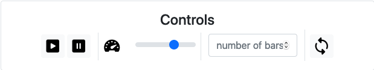

# Sorting Visualizations

This is a sorting visualization of five of the most popular sorting algorithms:

- Bubble Sort
- Heapsort
- Insertion sort
- Merge sort and
- Quicksort

## Demo

You can see a [**Demo here**](https://sortingvisualizerbyutkarsh.netlify.app/)

### Example: Quicksort

## Usage

1. Play / Resume
2. Pause
3. Speed
4. Length of (random generated) array to sort
5. Repeat with different values (but same number of elements)

> You can also hover over the elements and a description will be shown

P
